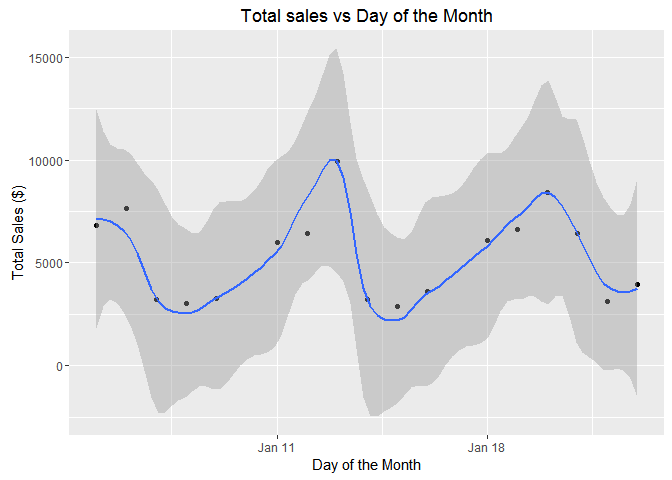
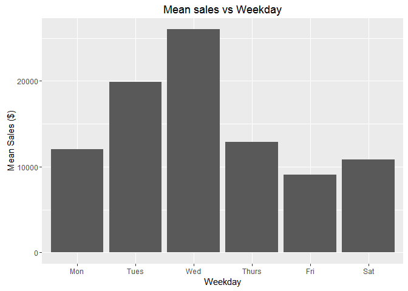
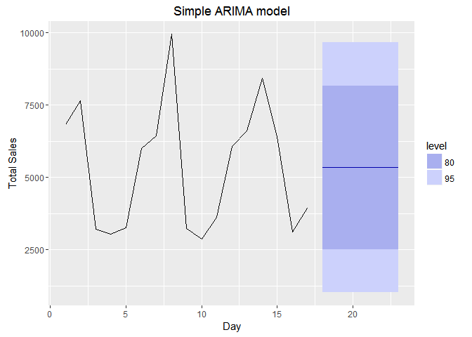
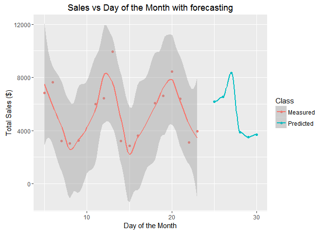

Predicting the next week of sales in a restaurant
================

Case Statement
--------------

Given a series of restaurant bills within a 3-week period in a given month, predict the sales on the 4th week.

Reading the data
----------------

Data was extracted from the "sample.txt" file and manual inspection (on Sublime) revealed it was structured as JSON.

``` r
library(tidyjson) # For dealing with JSON data
library(tidyverse) # Standard manipulation tools
library(lubridate) # For dealing with dates
library(knitr) # For formatting

set.seed(2) # For reproducibility


## Reading
filename <- "./sample.txt"

raw.txt <- read_file(filename)

raw.json <- raw.txt %>%
        as.tbl_json

## Structuring
raw.data <- raw.json %>%
        gather_array %>%
        spread_values(
                timestamp = jstring("ide", "dhEmi", "$date"),
                infoCpl = jstring("infAdic", "infCpl")
        ) %>%
        enter_object("dets") %>%
        gather_array %>%
        enter_object("prod") %>%
        spread_values(
                indTot = jstring("indTot"),
                qCom  = jnumber("qCom"),
                uCom = jstring("uCom"),
                vProd = jnumber("vProd"),
                vUnCom = jnumber("vUnCom"),
                xProd = jstring("xProd")
        )

## Cleaning
clean.data <- raw.data %>%
        select(
                timestamp, 
                infoCpl, 
                vProd, 
                xProd
        ) %>%
        rename(
                Timestamp = timestamp,
                Table = infoCpl,
                Value = vProd,
                Product = xProd
        ) %>%
        mutate(
                Timestamp = as_datetime(Timestamp),
                Date = as_date(Timestamp),
                Weekday = wday(Timestamp, label = TRUE),
                Table = toupper(Table)
        )

## Cleaned data
kable(head(clean.data, 5), digits = 2, format = "html")
```

<table>
<thead>
<tr>
<th style="text-align:left;">
Timestamp
</th>
<th style="text-align:left;">
Table
</th>
<th style="text-align:right;">
Value
</th>
<th style="text-align:left;">
Product
</th>
<th style="text-align:left;">
Date
</th>
<th style="text-align:left;">
Weekday
</th>
</tr>
</thead>
<tbody>
<tr>
<td style="text-align:left;">
2016-01-05 02:00:00
</td>
<td style="text-align:left;">
MESA 2
</td>
<td style="text-align:right;">
3.50
</td>
<td style="text-align:left;">
AGUA
</td>
<td style="text-align:left;">
2016-01-05
</td>
<td style="text-align:left;">
Tues
</td>
</tr>
<tr>
<td style="text-align:left;">
2016-01-05 02:00:00
</td>
<td style="text-align:left;">
MESA 2
</td>
<td style="text-align:right;">
21.40
</td>
<td style="text-align:left;">
BUFFET
</td>
<td style="text-align:left;">
2016-01-05
</td>
<td style="text-align:left;">
Tues
</td>
</tr>
<tr>
<td style="text-align:left;">
2016-01-05 02:00:00
</td>
<td style="text-align:left;">
MESA 1
</td>
<td style="text-align:right;">
83.55
</td>
<td style="text-align:left;">
BUFFET
</td>
<td style="text-align:left;">
2016-01-05
</td>
<td style="text-align:left;">
Tues
</td>
</tr>
<tr>
<td style="text-align:left;">
2016-01-05 02:00:00
</td>
<td style="text-align:left;">
MESA 1
</td>
<td style="text-align:right;">
9.00
</td>
<td style="text-align:left;">
REFRIGERANTE
</td>
<td style="text-align:left;">
2016-01-05
</td>
<td style="text-align:left;">
Tues
</td>
</tr>
<tr>
<td style="text-align:left;">
2016-01-05 02:00:00
</td>
<td style="text-align:left;">
MESA 5
</td>
<td style="text-align:right;">
4.50
</td>
<td style="text-align:left;">
SUCO
</td>
<td style="text-align:left;">
2016-01-05
</td>
<td style="text-align:left;">
Tues
</td>
</tr>
</tbody>
</table>
Exploratory analysis
--------------------

With some quick exploration we have found that the day of the week seems to be a important variable to predict the daily sales value. On a individual customer level, there are some tables that seem to spend more than others, as well as some "products".

``` r
## Understanding the time series
clean.data %>%
        group_by(Date) %>%
        summarise(Total = sum(Value)) %>%
        ggplot(aes(x = Date, y = Total)) +
        geom_point() + 
        geom_smooth(span = 0.3) + 
        labs(title = "Total sales vs Day of the Month",
             y = "Total Sales ($)", x = "Day of the Month")
```



``` r
## Understanding factor variables - Weekday (Mon, Tue, Wed, etc)
clean.data %>%
        group_by(Weekday) %>%
        summarise(Mean = mean(sum(Value))) %>%
        ggplot(aes(Weekday, Mean)) +
        geom_bar(stat = "identity") +
        labs(title = "Mean sales vs Weekday",
             y = "Mean Sales ($)")
```



Forecasting the next week
-------------------------

With some understanding of the data we can apply quick techniques to forecast the next week.

#### Simple ARIMA

``` r
library(xts) # For creating time series objects
library(forecast) # For ARIMA functions

# Prepare the train data
model.data <- clean.data %>%
        group_by(Date, Weekday) %>%
        summarise(Total = sum(Value))

timeseries <- with(
        model.data, 
        xts(Total, Date)
)

# Fit the arima model
arima.fit <- auto.arima(timeseries)

fc <- forecast(arima.fit, h = 6)

autoplot(fc) + labs(title = "Simple ARIMA model", x = "Day", y = "Total Sales")
```



### Using a randomForest model

``` r
library(caret) # For general ML

model.data <- clean.data %>%
        group_by(Date, Weekday) %>%
        summarise(Total = sum(Value)) %>%
        ungroup() %>%
        mutate(Date = day(Date),
               Weekday = as.factor(Weekday))

# Splitting the model data in train and test sets
train.size = 0.9

train.data = model.data %>%
        filter(Date <= train.size*max(Date))

test.data = model.data %>%
        filter(! (Date %in% train.data$Date))


# Training the model

train_control <- trainControl(method="cv", number=10)

model.lm <- train(Total ~ Weekday + Date, data = train.data, 
      trControl=train_control, method="rf")

## Testing the model
tested.data <- predict(model.lm, newdata = test.data)

modelvalues<-data.frame(obs = test.data$Total, pred=tested.data)

defaultSummary(modelvalues)
```

    ##         RMSE     Rsquared 
    ## 1483.4970978    0.8907905

``` r
rsquared <- 100*round(defaultSummary(modelvalues)[2],3)

## Applying the model
new.data <- tibble::data_frame(Date = 25:30) %>%
        mutate(
                Date = as_date(paste0("2016-01-", Date)), 
                Weekday = wday(Date, label = TRUE)
               ) %>%
        mutate(Date = day(Date))
predicted.data <- predict(model.lm, newdata = new.data)

new.data <- new.data %>%
        mutate(
                Total = predicted.data,
                Class = "Predicted"
                )

old.data <- clean.data %>%
        group_by(Date, Weekday) %>%
        summarise(Total = sum(Value),
                  Class = "Measured") %>%
        ungroup() %>%
        mutate(Date = day(Date))

result.data <- old.data %>%
        bind_rows(new.data)

final.plot <- result.data %>%
        ggplot(aes(x = Date, y = Total, color = Class)) +
        geom_point() + 
        geom_smooth(span = 0.4) + 
        labs(title = "Sales vs Day of the Month with forecasting",
             y = "Total Sales ($)", x = "Day of the Month")

final.plot
```



Final thoughts
--------------

With the small number of data points it was more difficult to establish a proper ARIMA model with the day of the week variable. However an ARIMA model was create to give a very rough forecast with a 80% C.I. of sales ranging between $2500 and $7500.

On a more traditional machine learning approach, however, it was possible to fit a RF model with the Rsquared value of 89.1% and predict the next week in sales with day-specific values.
